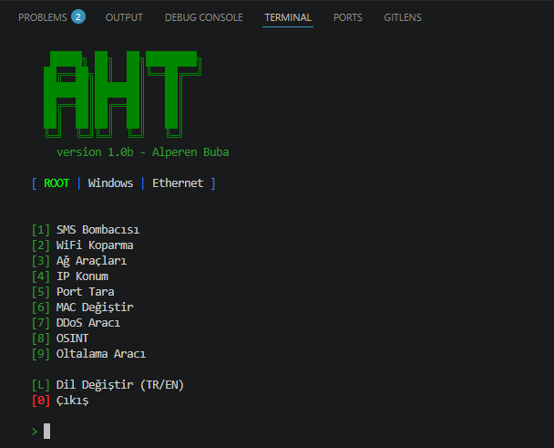

<p align="center">
  
</p>

<h1 align="center">AHT - All Hacking Tools</h1>

<p align="center">
  <b>Sürüm:</b> 1.1 &nbsp;|&nbsp; <b>Yazar:</b> Alperen Buba &nbsp;|&nbsp;
  <b>Platform:</b> Windows / Linux
</p>

<p align="center">
  
  
  
</p>

<p align="center">
  <b>OSINT | SMS Bomber | Network Tools | Phishing</b>
</p>

AHT, OSINT, SMS bombing, network tools, phishing, port scanning, MSFVenom payload üretimi ve daha fazlasını tek bir CLI aracında birleştiren kapsamlı bir güvenlik test aracıdır.

---

## Özellikler

### 1. SMS Bomber
- **Türk API'leri (33 servis):** KahveDunyasi, BIM, EnglishHome, Hayatsu, HizliEcza, MetroTR, FileMarket, Komagene, UysalMarket, Yapp, LittleCaesars, Domino's, Frink, Bodrum, Pidem, Koton, Alixavien, JimmyKey, WMF, Suiste, KimGb, TiklaGelsin, Naosstars, Akasya, Akbati, Porty, Tasdelen, KofteciYusuf, Coffy, Hamidiye, Orwi
- **Uluslararası API'ler:** Textbelt, Callmebot
- 3 thread + random servis seçimi
- Sınırsız mod (Turbo), CTRL+C ile durdurma
- Random delay (rate-limit koruması)

### 2. WiFi Deauth
- Aircrack-ng (aireplay-ng)
- MDK4
- Scapy Deauth
- Monitor mod desteği

### 3. Network Tools (Bettercap)
- ARP Spoofing
- Ağ taraması
- Bettercap entegrasyonu

### 4. IP Geolocation
- IP adresi konum sorgulama
- ISS ve şehir bilgisi

### 5. Port Scanner
- TCP bağlantı noktası tarama
- Hızlı ve detaylı mod

### 6. MAC Changer
- Ağ arayüzü MAC adresi değiştirme
- Rastgele MAC oluşturma

### 7. DDoS Tool
- HTTP Flood saldırıları
- Hedef IP/port desteği

### 8. OSINT (Açık Kaynak İstihbaratı)
- **Kullanıcı Tara:** Sherlock ile sosyal medya hesap tarama
- **Web Ara:** DuckDuckGo üzerinden arama
- **Telefon Numarası OSINT:** Numara analizi, operatör tespiti, Google dork linkleri, txt kayıt
- **Google Dorking:** Dosya türü filtresi menüsü, Google scraping + DuckDuckGo yedek, txt kayıt

### 9. MSFVenom Payload Üretici
- Metasploit Framework otomatik indirme ve kurulum (eksikse)
- Platform seçimi: Windows, Android, Linux, Mac, PHP, Python
- LHOST/LPORT yapılandırması
- Çıktı formatları: exe, py, php, war, elf, apk, raw

### 10. Phishing (Oltalama)
- **Sahte Sayfa Oluşturucu:** Instagram, Facebook, Google, Twitter/X
- **Phishing Sunucusu:** HTTP sunucu ile ziyaretçi bilgileri toplama (IP, lokasyon, tarayıcı)
- **Cloudflare Tunnel:** Cloudflared ile herkese açık URL oluşturma

---

## Kurulum

### Windows

**Önerilen:** Hazır .exe dosyasını indirin: [TurkByteSoftware](https://alperenbuba.github.io/TurkByteSoftware/)

veya kaynak koddan çalıştırmak için:

```bash
python main.py
```

Tüm bağımlılıklar (Python paketleri, Npcap, IP forwarding) ilk çalıştırmada otomatik kurulur.

### Linux

```bash
pip install scapy colorama requests beautifulsoup4 duckduckgo_search
python3 main.py
```

---

## Kullanım

```bash
python main.py
```

Menüde gezinmek için sayı tuşlarını kullanın. Dil değiştirmek için **L** tuşuna basın.

### Ana Menü

```
[1]  SMS Bomber
[2]  WiFi Deauth
[3]  Network Tools
[4]  IP Geolocation
[5]  Port Scanner
[6]  MAC Changer
[7]  DDoS Tool
[8]  OSINT
[9]  Phishing
[10] MSFVenom Payload Üretici
[L]  Dil Değiştir
[0]  Çıkış
```

---

## Uyarı

> Bu araç yalnızca **eğitim** ve **güvenlik testi** amaçlıdır. Kullanımından doğacak tüm yasal sorumluluk kullanıcıya aittir. İzinsiz sistemlere karşı kullanılması **yasa dışı** olabilir.

---

<p align="center">
  <sub>Alperen Buba tarafından yapıldı</sub>
</p>
